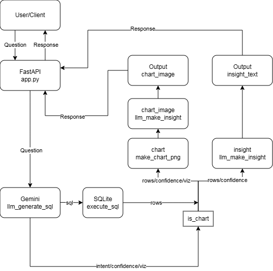
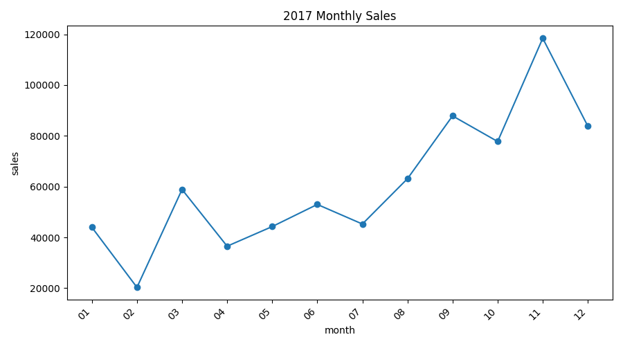

# README

## Project Overview

Superstore AI is an intelligent analytics system that transforms natural-language questions into executable SQL queries and visual insights. The system enables users to explore sales data interactively without requiring any knowledge of SQL or BI tools. By leveraging a Gemini-powered LLM for semantic understanding, Superstore AI automatically interprets business questions, retrieves relevant information from a local SQLite DataMart, and generates either concise textual insights or visual charts that summarize key performance indicators.

## Features

1. Natural Vietnamese Query Understanding
Superstore AI allows users to ask questions about sales data in plain Vietnamese, for example:

“Did revenue in September increase or decrease compared to August?”
“Which product category generated the highest profit last quarter?”

2. Automatic SQL Generation with Gemini
The system uses Gemini 2.0 Flash to translate user questions into precise SQL statements based on the provided schema in schema_catalog.json.

3. Instant Query Execution and Data Retrieval
Generated SQL queries are executed on the local SQLite DataMart (salesmart.db), and results are returned as structured lists of dictionaries (List[Dict]).

4. Automatic Chart Detection and Rendering
When the LLM identifies a visualization intent (intent = "chart", confidence ≥ 0.8), the system automatically renders a bar or line chart using Matplotlib, saves it in artifacts/charts, and returns the chart as a .png image.

5. Concise Vietnamese Insight Generation
After retrieving the data, Gemini generates a short Vietnamese insight summary (≤ 2 sentences) that describes key trends or comparisons, for example:
“Revenue in September increased by 12% compared to August, mainly driven by the Furniture category.”

## System Architecture



The Superstore AI system operates as follows: the user submits a natural-language question to the FastAPI /ask endpoint, which forwards the query to the Gemini model (llm_generate_sql) for semantic interpretation and generation of an SQL query along with supplementary information including intent, confidence, and viz. The generated SQL is executed on the SQLite database (execute_sql) to produce query results (rows). Based on intent, confidence, and viz, the system determines whether to render a chart (is_chart). If required, the data is passed to the renderer (make_chart_png) to create a chart image (chart_image); otherwise, a textual insight (insight_text) is generated. Finally, FastAPI returns the response to the user, containing either the chart with its analytical summary or the textual insight only.

## Technologies Used

| Component      | Technology        |
|----------------|-------------------|
| **API Server** | FastAPI           |
| **Database**   | SQLite            |
| **LLM**        | Gemini 2.0 Flash  |
| **Visualization** | Matplotlib     |
| **Language**   | Python 3.11       |

## Dataset

This project uses the Superstore Sales Dataset, a well-known retail analytics dataset widely used in BI, dashboarding, and machine-learning experiments. It contains detailed information on orders, customers, products, shipments, and profitability making it ideal for building a natural-language analytics system like Superstore AI.

1. **Context**

A major Superstore retailer aims to understand which products, regions, categories, and customer segments perform best. The dataset enables various analyses such as revenue trends, product profitability, customer segmentation, and even predictive modeling for Sales or Profit.

2. **Dataset Link**

https://www.kaggle.com/datasets/vivek468/superstore-dataset-final

3. **Data Preparation for This Project**

To align with the project format required by my mentor, the original dataset (CSV) was converted to XLSX before building the SQLite DataMart.
The .xlsx file then served as the source for generating the salesmart.db database via the datamart_build.py script.

## Installation

For this project, **python=3.11** are used.

1. **Clone the repository.**

   ```bash
   git clone https://github.com/anhnd210020/superstore.git
   cd superstore
   ```

2. **Create a virtual environment for Supestore and and activate the environment.**

   ```bash
   conda create -n superstore python=3.11
   conda activate superstore
   ```

3. **Install other dependencies.**

   ```bash
   pip install -r requirements.txt
   ```

## Environment Variables (.env)

Create a `.env` file in the project root directory with the following content:

   ```bash
   GEMINI_API_KEY="your_api_key_here"
   GEMINI_MODEL="gemini-2.0-flash"
   ```

## Run the API Server

To start the FastAPI server, run the following command in the project root:

   ```bash
   uvicorn app.api.app:app --reload --port 8000
   ```

## File Organization
```text
├── app
│   ├── api
│   │   ├── app.py
│   ├── dataops
│   │   ├── datamart_build.py
│   │   ├── insight_log.py
│   │   ├── kpi_compute.py
│   ├── intents
│   │   └── query_engine.py
│   ├── llm
│   │   ├── llm_client.py
│   ├── service
│   │   ├── ask_pipeline.py
│   └── vis
│       ├── chart_renderer.py
│       ├── chart_store.py
├── pic
│   ├── 2017MonthlySales.png
│   └── System_Architecture_Superstore.png
├── README.md
├── requirements.txt          
```

## Example Usage

### Example 1: Insight Generation

**Input**
```json
{
  "question": "Doanh thu tháng 2017-11 tăng hay giảm so với tháng trước?"
}
```

**Output**
```json
{
  "insight_text": "Doanh thu tháng 11 năm 2017 tăng trưởng mạnh so với tháng trước, đạt mức tăng 52.29%. Đây là một tín hiệu tích cực cho thấy hiệu quả kinh doanh đang được cải thiện."
}
```

### Example 2: Chart Generation

**Input**
```json
{
  "question": "Vẽ biểu đồ năm 2017"
}
```

**Output**


##  Author

**Nguyễn Đức Anh**
University: Hanoi University of Science and Technology (HUST)
Email: [anh.nd210020@gmail.com](mailto:anh.nd210020@gmail.com)
Address: Hanoi, Vietnam
GitHub: [anhnd210020](https://github.com/anhnd210020)
