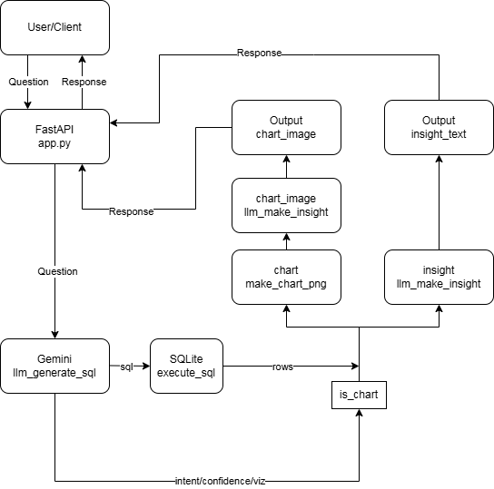

# README

## Project Overview

Superstore AI is an intelligent LLM-powered analytics system that allows users to explore and understand sales data using natural language questions in Vietnamese.

The system interprets each question, generates the appropriate SQL query for a local SQLite database, executes it, and then returns concise insights or visual charts depending on the detected intent.

## Features

1. Natural Vietnamese Query Understanding
Superstore AI allows users to ask questions about sales data in plain Vietnamese, for example:

“Did revenue in September increase or decrease compared to August?”
“Which product category generated the highest profit last quarter?”

2. Automatic SQL Generation with Gemini
The system uses Gemini 2.0 Flash to translate user questions into precise SQL statements based on the provided schema in schema_catalog.json.

3. Instant Query Execution and Data Retrieval
Generated SQL queries are executed on the local SQLite DataMart (salesmart.db), and results are returned as structured lists of dictionaries (List[Dict]).

4. Automatic Chart Detection and Rendering
When the LLM identifies a visualization intent (intent = "chart", confidence ≥ 0.8), the system automatically renders a bar or line chart using Matplotlib, saves it in artifacts/charts, and returns the chart as a .png image.

5. Concise Vietnamese Insight Generation
After retrieving the data, Gemini generates a short Vietnamese insight summary (≤ 2 sentences) that describes key trends or comparisons, for example:
“Revenue in September increased by 12% compared to August, mainly driven by the Furniture category.”

## System Architecture



The diagram shows the overall workflow of the **Superstore AI** system. A user or client sends a **POST /ask** request containing a Vietnamese question to the **FastAPI server**. The request is handled by `app.py`, which calls the core function `ask_pipeline.ask_once`. Inside this pipeline, **Gemini (LLM #1)** is used through `llm_generate_sql()` to convert the natural-language question into an SQL query. This SQL query is then executed on the **SQLite database (`artifacts/salesmart.db`)**, and the resulting data rows are passed to **Gemini (LLM #2)** via `llm_make_insight()` to generate a short and readable Vietnamese insight. Finally, **FastAPI** packages the generated `insight_text` and returns it to the user as a **JSON response**.

## Technologies Used

| Component      | Technology        |
|----------------|-------------------|
| **API Server** | FastAPI           |
| **Database**   | SQLite            |
| **LLM**        | Gemini 2.0 Flash  |
| **Visualization** | Matplotlib     |
| **Language**   | Python 3.11       |

## Installation

For this project, **python=3.11** are used.

1. **Clone the repository.**

   ```bash
   git clone https://github.com/anhnd210020/superstore.git
   cd superstore
   ```

2. **Create a virtual environment for SurgicalSAM and and activate the environment.**

   ```bash
   conda create -n superstore python=3.11
   conda activate superstore
   ```

3. **Install other dependencies.**

   ```bash
   pip install -r requirements.txt
   ```

## Environment Variables (.env)

Create a `.env` file in the project root directory with the following content:

   ```bash
   GEMINI_API_KEY="your_api_key_here"
   GEMINI_MODEL="gemini-2.0-flash"
   ```

## Run the API Server

To start the FastAPI server, run the following command in the project root:

   ```bash
   uvicorn app.api.app:app --reload
   ```

## File Organization
```text
├── app
│   ├── api
│   │   ├── app.py
│   ├── dataops
│   │   ├── datamart_build.py
│   │   ├── insight_log.py
│   │   ├── kpi_compute.py
│   ├── intents
│   │   └── query_engine.py
│   ├── llm
│   │   ├── llm_client.py
│   ├── service
│   │   ├── ask_pipeline.py
│   └── vis
│       ├── chart_renderer.py
│       ├── chart_store.py
├── pic
│   ├── 2017MonthlySales.png
│   └── System_Architecture_Superstore.png
├── README.md
├── requirements.txt          
```

## Example Usage

### Example 1: Insight Generation

**Input**
```json
{
  "question": "Doanh thu tháng 2017-11 tăng hay giảm so với tháng trước?"
}
```

**Output**
```json
{
  "insight_text": "Doanh thu tháng 11 năm 2017 tăng trưởng mạnh so với tháng trước, đạt mức tăng 52.29%. Đây là một tín hiệu tích cực cho thấy hiệu quả kinh doanh đang được cải thiện."
}
```

### Example 2: Chart Generation

**Input**
```json
{
  "question": "Vẽ biểu đồ năm 2017"
}
```

**Output**
